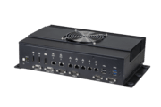
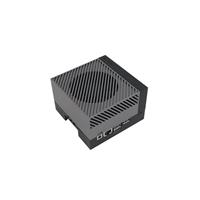
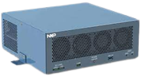

# ARM-based ECUs

The page lists the ARM-based ECUs being tested for LSA, which can meet the computation capacity requirement of LSA but does not overprovision the resource requirements.

Another page on [Autoware Document](https://autowarefoundation.github.io/autoware-documentation/main/reference-hw/ad-computers/) lists the ECUs being for other use scenarios.

(Candidates of the ECUs to be used by the LSA in the alphabetical order)

## **ADLINK In-Vehicle Computers**

ADLINK solutions which is used for autonomous driving and tested by one or more community members are listed below:

  <!-- cspell: ignore Altra BLUEBOX Grms Quadro Vecow vecow -->

| Supported Products List         | CPU                                    | GPU                      | RAM, Interfaces                                                                                    | Environmental                                                                                  | Autoware Tested (Y/N) |
| ------------------------------- | -------------------------------------- | ------------------------ | -------------------------------------------------------------------------------------------------- | ---------------------------------------------------------------------------------------------- | --------------------- |
| SOAFEE’s AVA Developer Platform | Ampere Altra ARMv8                     | optional                 | USB, Ethernet, DIO, M.2 NVMe SSDs                                                                  | 110/220 AC                                                                                     | Y                     |
| RQX-58G                         | 8-core Arm                             | Nvidia Jetson AGX Xavier | USB, Ethernet, M.2 NVME SSD, CAN, USIM, GMSL2 Camera support                                       | 9~36VDC, IEC 60068-2-64: Operating 3Grms, 5-500 Hz, 3 axes                                     | Y                     |
| RQX-59G                         | 8-core Arm                             | Nvidia Jetson AGX Orin   | USB, Ethernet, M.2 NVME SSD, CAN, USIM, GMSL2 Camera support                                       | 9~36VDC, IEC 60068-2-64: Operating 3Grms, 5-500 Hz, 3 axes                                     | -                     |

Link to company website is [here.](https://www.adlinktech.com/en/Connected-Autonomous-Vehicle-Solutions)

## **Advantech In-Vehicle Computers**

Advantech's autonomous driving and robotic computers are of compact size, with GMSL camera and other sensor data available at ROS level.

| Supported Products List | CPU | GPU | RAM, Interfaces | Environmental | Autoware Tested (Y/N) |
| --- | --- | --- | --- | --- |--- |
| **AFE-R750-X0A1U** (AGX Orin 32GB/64GB system, but the board  ASR-A701 is also avaialbe) | 8/12-core NVIDIA Arm® Cortex A78AE v8.2 | 1792/2048-core NVIDIA Ampere GPU with 56/64 Tensor Cores | <ul><li>8 x GMSL2 cameras</li><li>BOSCH BMI088 IMU</li><li>Xsens MTi3 IMU (Optional)</li><li>32/64GB 256-bit LPDDR5 DRAM</li><li> 4 x 2.5GbE, 4 x USB 3.2 Type A, 2 x isolated CANFD, 16bit isolated DIO, 2 x RS232/422/485</li> </ul> | <ul><li>20~28V DC</li> <li>-10 ~ 60°C/50°C with 0.7 m/s air flow for 32GB/64GB</li></ul> |Y|

Link to company website is [here.](https://campaign.advantech.online/en/AMR-Robotic-Solutions/)

## **nVidia In-Vehicle Computers**

nVidia provides the development kit as a reference design.

| Supported Products List | CPU                     | GPU                        | RAM, Interfaces                                 | Environmental | Autoware Tested (Y/N) |
| ----------------------- | ----------------------- | -------------------------- | ----------------------------------------------- | ------------- | --------------------- |
| nVidia Jetson Orin             | 12-core Arm® Cortex®-A78AE v8.2 64-bit CPU 3MB L2 + 6MB L3 | 2048-core NVIDIA Ampere architecture GPU with 64 Tensor Cores | 64 GB RAM, Up to 6 cameras (16 via virtual channels), 4x USB2.0 1x 1GbE, 1x10GbE | None      | Yes                     |
| DRIVE AGX Orin Developer Kit   | 12 Cortex-A78A CPU | 2048-core NVIDIA Ampere architecture GPU with 64 Tensor Cores | 16x GMSL cameras, 2x 10GbE, 10x 1GbE, 6x 100 MbE, 6 CAN  |  ASIL-D    | (TBA)                     |

Link to company website is [here.](https://www.nvidia.com/en-us/autonomous-machines/embedded-systems/jetson-orin/)

## **NXP In-Vehicle Computers**

NXP solutions which is used for autonomous driving and tested by one or more community members are listed below:

| Supported Products List | CPU                     | GPU                        | RAM, Interfaces                                 | Environmental | Autoware Tested (Y/N) |
| ----------------------- | ----------------------- | -------------------------- | ----------------------------------------------- | ------------- | --------------------- |
| BLUEBOX 3.0             | 16 x Arm® Cortex®-A72 | Dual RTX 8000 or RTX A6000 | 16 GB RAM CAN, FlexRay, USB, Ethernet, DIO, SSD | ASIL-D        | -                     |

Link to company website is [here.](https://www.nxp.com/design/designs/bluebox-3-0-automotive-high-performance-compute-ahpc-development-platform:BlueBox)
