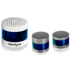
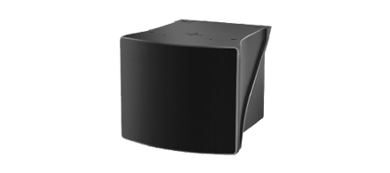

# Hardware Configuration

(To be completed)

The page lists the sensors and actuators being tested for LSA, which can support the ODD of LSA. 

For software configuration of these sensors, see the [Sensor Configuration Guide](../../software-configuration/sensor-configuration/index.md).

Another page on [Autoware Document](https://autowarefoundation.github.io/autoware-documentation/main/reference-hw/lidars/) lists the sensors and actuators being used for other use scenarios.

## **Velodyne 3D LIDAR Sensors**

Velodyne Lidars which has ROS 2 driver and tested by one or more community members are listed below:

**Software Configuration**: See [Velodyne LiDAR Configuration Guide](../../software-configuration/sensor-configuration/index.md#velodyne-lidar)

| Supported Products List | Range | FOV (V), (H)          | ROS 2 Driver | Autoware Tested (Y/N) |
| ----------------------- | ----- | --------------------- | ------------ | --------------------- |
| Alpha Prime             | 245m  | (+15°)/(-25°), (360°) | Y            | Y                     |
| Ultra Puck              | 200m  | (+15°)/(-25°), (360°) | Y            | Y                     |
| Puck                    | 100m  | (+15°)/(-15°), (360°) | Y            | Y                     |
| Puck Hi-res             | 100m  | (+10°)/(-10°), (360°) | Y            | Y                     |

## **Ouster 3D LIDAR Sensors**

Ouster Lidars which has ROS 2 driver and tested by one or more community members are listed below:

**Software Configuration**: See [Ouster LiDAR Configuration Guide](../../software-configuration/sensor-configuration/index.md#ouster-lidar)

| Supported Products List | Range | FOV (V), (H)    | ROS 2 Driver | Autoware Tested (Y/N) |
| ----------------------- | ----- | --------------- | ------------ | --------------------- |
| OSDome                  | 45m   | (180°), (360°)  | Y            | -                     |
| OS0                     | 100m  | (90°), (360°)   | Y            | -                     |
| OS1                     | 200m  | (45°), (360°)   | Y            | -                     |
| OS2                     | 400m  | (22,5°), (360°) | Y            | Y                     |

Link to ROS 2 driver:  
[https://github.com/ros-drivers/ros2_ouster_drivers](https://github.com/ros-drivers/ros2_ouster_drivers)

Link to company website:  
[https://ouster.com/](https://ouster.com/)

## **Robin W Wide FOV LiDAR**

Robin W Wide FoV Lidars which has ROS 2 driver and tested by one or more community members are listed below:

| Supported Products List | Range | FOV (V), (H)    | ROS 2 Driver | Autoware Tested (Y/N) |
| ----------------------- | ----- | --------------- | ------------ | --------------------- |
| Wide FOV LiDAR                  | 0.1m~150m    | (120°), (70°)  | Y            | Yes                     |

Link to company website:  
[https://www.seyond.com/products/robin-w/](https://www.seyond.com/products/robin-w/)