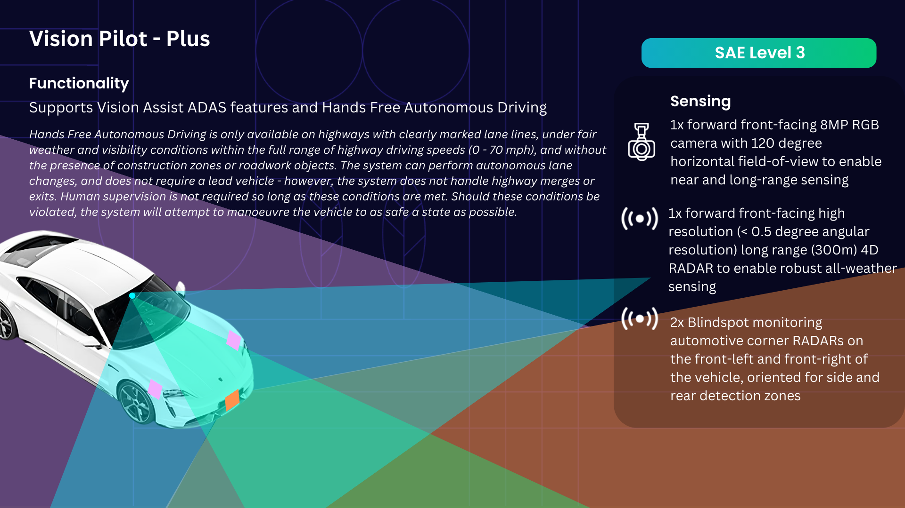

# Hardware Configuration

(To be completed)

This section describes the hardware configurations for PoV vehicles, including

- [Chassis](chassis/index.md): describes the design specification of the chassis
- [Sensors and Actuators](Sensors-and-Actuators/index.md): describes the sensors and actuators used in the reference design.
- [ECUs](ECUs/index.md): describes the ECUs used in the reference design.

The sensors requirements are different based on different PoV version.

- Vision Pilot

- Vision Pilot Plus

- Vision Pilot Pro

- Vision Drive

