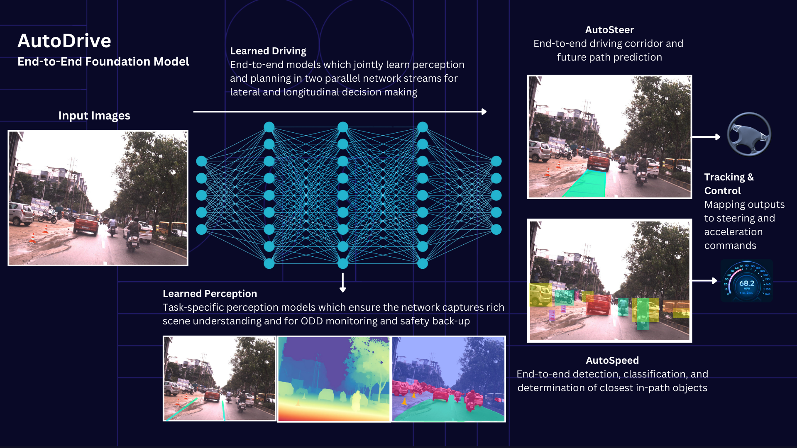

# Introduction

## About Reference Design Guideline for PoV Vehicles

This document serves a guideline to design and deploy a TRL-6 privately-owned vehicles based on Autoware. The readers can take this document as a starting point to select and configure the hardware and software components of the vehicles.

The Autoware uses the end-to-end foundation model on the privately-owned vehicles, shown as below.

## Reference Design Guideline for PoV Vehicles documentation structure

The document publishes the guidelines for Privately-owned Vehicles (PoV), using the following document structure shown below.

The document consists of four major components:

- ODD Definition defines the operation environment of the PoV.
- Hardware configuration describes the sensors and actuators used on the PoV. There is no reference physical chassis.
- Software configuration describes the process of deploying the software on ECUs.
- Evaluation and testing describes the process of evaluating and testing the software for the PoVs. The dataset and performance metrics are shown.

There are fours phases on designing the software for PoV. The details of the roadmap are discussed on [this page](https://github.com/autowarefoundation/autoware.privately-owned-vehicles). Below summarizes the configuration and expected outcomes for each phase. This document provides the design guideline for Vision Pilot in Phase 1.

- **Vision Pilot** (Phase 1): using 1x forward front-facing RGB camera to enable near and long-range sensing to enable SAE Level 2+/2++ automation.
- **Vision Pilot - Plus** (Phase 2): using 1x forward front-facing RGB camera and 1x forward front-facing high
resolution 4D radar, and 2x Blindspot monitoring automotive corner RADAR  to enable SAE Level 3 automation.
- **Vision Pilot - Pro** (Phase 3): using 3x forward front-facing RGB camera, 1x forward front-facing high
resolution 4D radar, 2x Blindspot monitoring automotive corner RADAR, and standard 2D Navigational map
with GPS to enable SAE Level 3 automation.
- **Vision Drive** (Phase 4): using 3x forward front-facing RGB camera, 1x forward front-facing high
resolution 4D radar, 2x Blindspot monitoring automotive corner RADAR, and standard 2D Navigational map
with GPS to enable SAE Level 4 automation.

For more details about the reference design WG, its goals and details of the Autoware Foundation working groups that oversees the project, refer to the [Reference Design WG wiki](https://github.com/autowarefoundation/RefDesignWG/wiki/)

## Getting started

- [System Configuration](./system-configuration/index.md)
- [ODD](./odd-definition/index.md)
- [Hardware Configuration](./hardware-configuration/index.md)
- [Software Configuration](./software-configuration/index.md)
- [Evaluation and Testing](./evaluation-and-testing/index.md)
