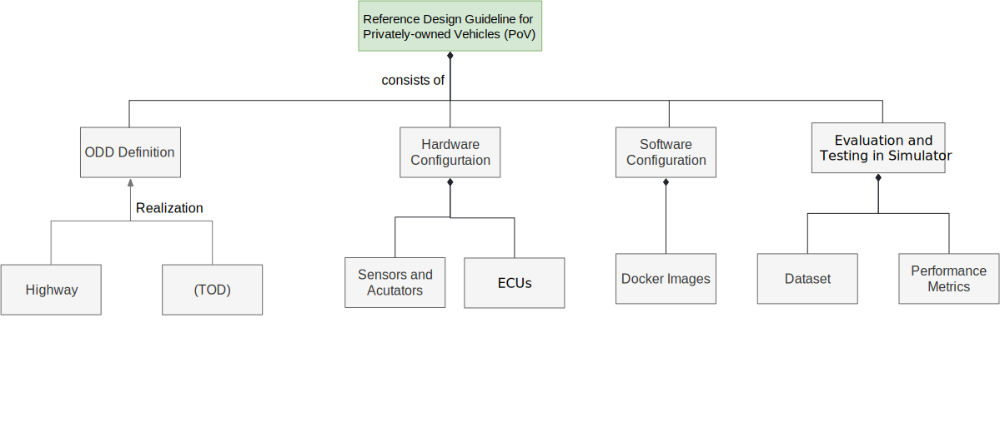

# Introduction

## About Reference Design Guideline for PoV Vehicles

This document serves a guideline to design and deploy a TRL-6 privately-owned vehicles based on Autoware. The readers can take this document as a starting point to select and configure the hardware and software components of the vehicles.

## Reference Design Guideline for PoV Vehicles documentation structure

The reference design WG publishes the guidelines for Privately-owned Vehicles (PoV), using the following document structure shown below.

For more details about the reference design WG, its goals and details of the Autoware Foundation working groups that oversees the project, refer to the [Reference Design WG wiki](https://github.com/autowarefoundation/RefDesignWG/wiki/)

## Getting started

- [ODD](./odd-definition/index.md)
- [Hardware Configuration](./hardware-configuration/index.md)
- [Software Configuration](./software-configuration/index.md)
- [Evaluation and Testing](./evaluation-and-testing/index.md)
