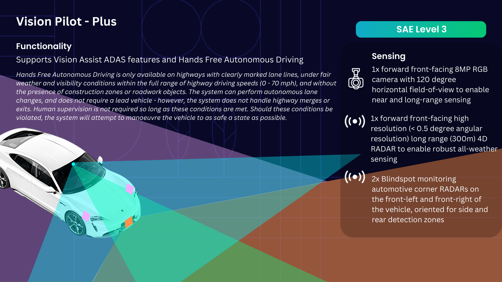

# ODD Definition

Operation Domain Definition (ODD) describes the use scenarios for the vehicles to be designed and deployed. The deployed system should meet the ODD to be functionality completed. This section describes the ODD user scenarios for PoV.

## Vision Pilot
Vision Pilot aims on Level 2+/2++ on the single lane highway. It will operate on highway with clearly marked lane lines, under fair weather and visibility conditions within the full range of highway driving speeds (0 - 70 mph), and without the presence of construction zones or roadwork objects. A human driver is required to monitor and supervise the system at all times.

It will support the following features:

- Forward collision warning
- Lane departure warning
- Adaptive headlights
- Automatic Emergency braking
- Lane departure avoidance
- Intelligent speed assist
- Traffic aware autonomous cruise control
- Autonomous lane keep and road following
- Hands free autopilot
  

## Vision Pilot - Plus 
Vision Pilot - Plus aims on Level 3 on the multiple lane highway. It will operate on highway with clearly marked lane lines, under fair weather and visibility conditions within the full range of highway driving speeds (0 - 70 mph), and without the presence of construction zones or roadwork objects. The system can operate autonomous lane changes, and does not require a lead vehicle - however, the system does not handle highway merges or exits. Human supervision is **not** required as long as these conditions are met. Should these conditions be violated, the system will attempt to manoeuvre the vehicle to as safe a state as possible. 

## Vision Pilot - Pro 
Vision Pilot - Pro aims on Level 3 on the multiple lane highway. It will operate on highway with clearly marked lane lines, under fair weather and visibility conditions within the full range of highway driving speeds (0 - 70 mph), and without the presence of construction zones or roadwork objects. The system can operate autonomous lane changes, and does not require a lead vehicle - however, the system does not handle highway merges or exits. Human supervision is **not** required as long as these conditions are met. Should these conditions be violated, the system will attempt to manoeuvre the vehicle to as safe a state as possible. 

## Vision Drive 
Vision Drive aims on Level 4 on the multiple lane highway. It will operate on highway with clearly marked lane lines, under fair weather and visibility conditions within the full range of highway driving speeds (0 - 70 mph), and without the presence of construction zones or roadwork objects. The system can operate autonomous lane changes, and does not require a lead vehicle - however, the system does not handle highway merges or exits. Human supervision is **not** required as long as these conditions are met. Should these conditions be violated, the system will attempt to manoeuvre the vehicle to as safe a state as possible. 

