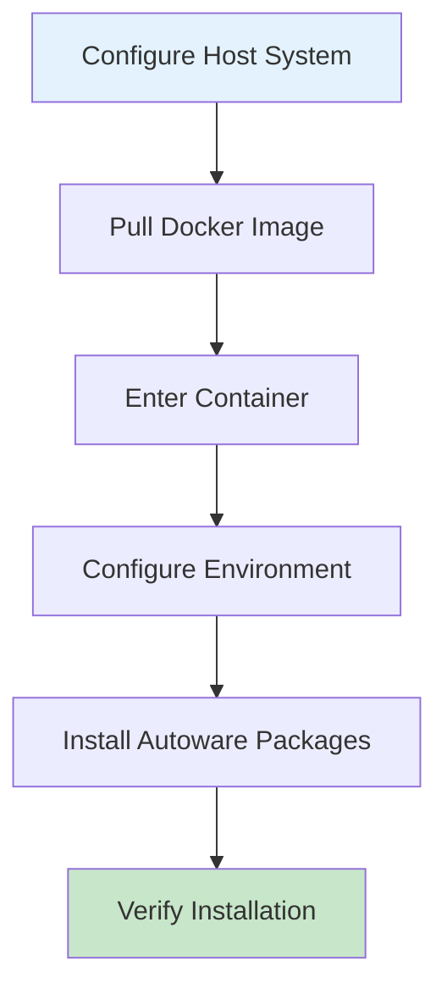

# Getting Started

Foundational setup for deploying Autoware on Ubuntu 22.04 (AMD64/ARM64).

## Deployment Overview



## System Requirements

### Hardware Requirements

#### Minimum Specifications
- **CPU**: 8-core x86_64 (Intel/AMD) or ARMv8 (ARM64)
- **RAM**: 32 GB (16 GB for simulation-only)
- **Storage**: 30 GB of free space
- **GPU**: NVIDIA GPU with CUDA 11.8+ and Compute Capability 5.0+ (required for perception)

#### Recommended Specifications
- **CPU**: 16+ cores
- **RAM**: 64 GB+
- **Storage**: 100 GB+ SSD
- **GPU**: NVIDIA RTX 3080+ (x86_64) or AGX Orin (ARM)

### Network
- Gigabit Ethernet for sensors
- Internet access for setup
- Optional: Secondary interface for vehicle communication

### Operating System
- Ubuntu 22.04 LTS
- Kernel 5.15+
- Real-time kernel recommended for production

## Deployment Options

Choose between two deployment approaches:

1. **Native Installation** - Direct installation on the host system
2. **Containerized Deployment** (Recommended) - Using Docker for isolation and reproducibility

## System Preparation

### 1. Install Essential Packages

```bash
# Update package lists and upgrade system
sudo apt update && sudo apt upgrade -y

# Install essential tools
sudo apt install -y \
  build-essential \
  cmake \
  git \
  wget \
  curl \
  gnupg \
  lsb-release \
  software-properties-common \
  python3-pip \
  python3-venv \
  ansible
```


## Containerized Deployment Workflow

This section describes the recommended containerized deployment approach using Docker, Ansible, and Debian packages.

### 1. Configure Host System

Before deploying containers, ensure your host system has the necessary tools:

1. **Install Docker Engine**: Follow the [official Docker installation guide for Ubuntu](https://docs.docker.com/engine/install/ubuntu/)
   ```bash
   # After installation, add user to docker group
   sudo usermod -aG docker $USER
   newgrp docker
   ```

2. **Install NVIDIA Container Toolkit**: Follow the [official NVIDIA installation guide](https://docs.nvidia.com/datacenter/cloud-native/container-toolkit/latest/install-guide.html)
   - **Note**: Pre-installed with JetPack on NVIDIA Jetson devices

3. **Install NVIDIA Driver**: Ensure NVIDIA drivers are installed on the host
   ```bash
   # Verify NVIDIA driver installation
   nvidia-smi
   ```

### 2. Pull Pre-configured Images

Use pre-configured Docker images that include CUDA and necessary dependencies:

#### For x86\_64 Systems
```bash
docker pull ghcr.io/autowarefoundation/autoware:universe-cuda-20250414
```

#### For ARM64 Systems (Jetson)
```bash
docker pull nvcr.io/nvidia/l4t-tensorrt:r8.6.2-devel
```

**Note**: These images include CUDA pre-installed. For custom CUDA installations, see [Workflow Customization](../workflow-customization/index.md).

### 3. Enter Container Environment

Launch the container with GPU support and necessary mounts:

```bash
docker run -it --name autoware-dev \
  --gpus all \
  --runtime nvidia \
  --network host \
  --privileged \
  -v ~/autoware-deployment:/workspace \
  -v /tmp/.X11-unix:/tmp/.X11-unix:rw \
  -e DISPLAY=$DISPLAY \
  <image-name> \
  /bin/bash
```

Replace `<image-name>` with the image you pulled in step 2.

### 4. Configure Container Environment with Ansible

Inside the container, download and run the Ansible configuration:

```bash
git clone -b 2025.02 https://github.com/autowarefoundation/autoware.git
cd autoware
./setup-dev-env.sh
```

### 5. Install Autoware Debian Packages

After Ansible configuration, visit the Autoware Debian package [release page](https://github.com/NEWSLabNTU/autoware/releases/tag/rosdebian%2F2025.02-1) and install Autoware packages:

```bash
# Configure Autoware repository (example for x86_64)
# Visit the release page and download autoware-localrepo_2025.2-1_amd64.deb. Then,
sudo apt install ./autoware-localrepo_2025.2-1_amd64.deb

# Update and install Autoware
sudo apt update
sudo apt install -y autoware-full

# Source the environment
source /opt/autoware/autoware-env
```

For ARM64/Jetson systems, use the appropriate repository package from the release page.

### 6. Verification

Verify the installation is successful:

```bash
# Check ROS 2 installation
ros2 --version

# Check Autoware packages
ros2 pkg list | grep autoware

# Verify CUDA (should show GPU information)
nvidia-smi

# Run a simple test
ros2 launch autoware_launch planning_simulator.launch.xml
```

If all checks pass, your containerized Autoware environment is ready for use.


## Post-Installation Verification

This section uses a shell script to verify if the Autoware is successfully deployed to the system.

### 1. System Check Script

Download the system check script [here](assets/verify-installation.sh) and move the shell script to the working directory. Executes the verification script to verify the deployment.

```bash
chmod +x verify-installation.sh
./verify-installation.sh
```

### 2. Test Basic Functionality

Follow the [tutorial](https://autowarefoundation.github.io/autoware-documentation/main/tutorials/ad-hoc-simulation/planning-simulation/) to run the planning simulation.

## Next Steps

With the base system configured, proceed to one of the following sections:

1. **[x86_64-based ECU Configuration](../x86_64-based_ECU/index.md)** for Intel/AMD platforms
2. **[ARM-based ECU Configuration](../ARM-based_ECU/index.md)** for NVIDIA Jetson and the other ARM platforms
