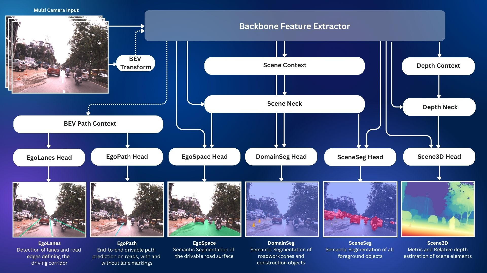

# Software Configuration

The software we deploy is [VisionPilot](https://github.com/autowarefoundation/autoware.privately-owned-vehicles)

[AutoSeg](https://github.com/autowarefoundation/autoware.privately-owned-vehicles/tree/main/AutoSeg) is an AI Foundation Model which provides real-time visual scene perception for autonomous vehicles. It utilizes a single neural network backbone to extract diverse image features, a set of context blocks which focus the network's attention on key visual elements within input images, a set of feature necks which aggregate and fuse multi-scale image features, and multiple segmentation and detection heads which provide useful perceptual outputs for autonomous decision making. Overall, the network is split into three branches, a Depth Branch which calculates the per-pixel scene depth, a Scene Branch which focuses on per-pixel scene segmentation, and a Path Branch, which focuses on driving corridor detection through multiple means.

AutoSeg is comprised of 6 neural network export models which include:

- Scene3D: Metric and Relative depth estimation of scene elements. [Detail](./Scene3D/index.md)
- SceneSeg: Semantic segmentation of all foreground objects. [Detail](./SceneSeg/index.md)
- DomainSeg: Semantic segmentation of roadwork zones and construction objects. [Detail](./DomainSeg/index.md)
- EgoSpace: Semantic Segmentation of the drivable road surface. [Detail](./EgoSpace/index.md)
- EgoPath: End-to-end drivable path prediction on roads, with and without lane markings. [Detail](./EgoPath/index.md)
- EgoLanes: Detection of lanes and road edges defining the driving corridor. [Detail](./EgoLanes/index.md)

