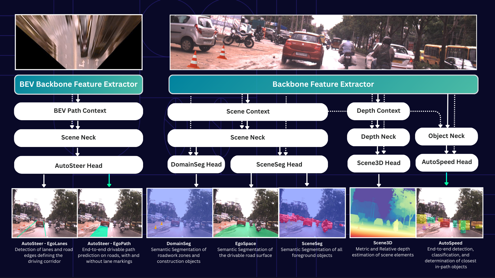

# Software Configuration

The software we deploy is [VisionPilot](https://github.com/autowarefoundation/autoware.privately-owned-vehicles)

- Scene3D: Metric and Relative depth estimation of scene elements
- SceneSeg: Semantic segmentation of all foreground objects
- DomainSeg: Semantic segmentation of roadwork zones and construction objects
- EgoSpace: Semantic Segmentation of the drivable road surface
- EgoPath: End-to-end drivable path prediction on roads, with and without lane markings
- EgoLanes: Detection of lanes and road edges defining the driving corridor

