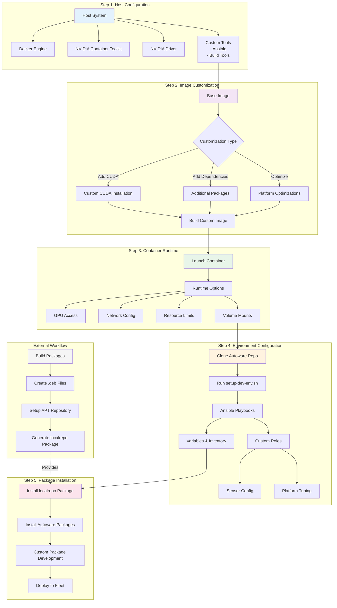

# Workflow Customization

This guide covers advanced customization options for the containerized Autoware deployment workflow.

## Customization Workflow Overview



## Step 1: Host Configuration Customization

### Install Host Sensor Drivers

Some of the sensors ship proprietary drivers and userspace libraries, usually named SDKs. For example, StereoLabs cameras require the ZED Link driver and the ZED SDK to be installed. In the containerized setup, the ZED Link driver is installed on the host system, while the SDK is installed in the container.

## Step 2: Image Customization

### CUDA Installation in Custom Images

While the recommended pre-built images include CUDA, you may need to install or update CUDA in custom containers:

### For x86\_64 Containers

```dockerfile
# Install CUDA in Dockerfile
RUN wget https://developer.download.nvidia.com/compute/cuda/repos/ubuntu2204/x86_64/cuda-keyring_1.1-1_all.deb && \
    dpkg -i cuda-keyring_1.1-1_all.deb && \
    apt-get update && \
    apt-get install -y cuda-toolkit-12-3 && \
    rm cuda-keyring_1.1-1_all.deb
```

### For ARM64/Jetson Containers

CUDA is typically pre-installed via JetPack. To verify or update:

```bash
# Check CUDA version
nvcc --version

# For custom installations, use NVIDIA SDK Manager on the host
```

### Creating Custom Dockerfiles

Extend the base Autoware image with custom components:

```dockerfile
# Dockerfile.custom
FROM ghcr.io/autowarefoundation/autoware:humble-2025.02-arm64

# Install additional dependencies
RUN apt-get update && apt-get install -y \
    custom-driver-package \
    additional-tools \
    && rm -rf /var/lib/apt/lists/*

# Copy custom configuration
COPY config/custom_params.yaml /opt/autoware/config/

# Add custom launch files
COPY launch/custom_autoware.launch.xml /opt/autoware/launch/

# Set custom environment variables
ENV CUSTOM_PARAM=value
ENV RMW_IMPLEMENTATION=rmw_cyclonedds_cpp

# Custom entrypoint
COPY scripts/custom_entrypoint.sh /
RUN chmod +x /custom_entrypoint.sh
ENTRYPOINT ["/custom_entrypoint.sh"]
```

### Multi-Stage Build for Development

```dockerfile
# Dockerfile.dev
# Build stage
FROM ghcr.io/autowarefoundation/autoware:humble-2025.02-arm64 AS builder

WORKDIR /workspace
COPY src/ ./src/

# Build custom packages
RUN . /opt/ros/humble/setup.bash && \
    colcon build --cmake-args -DCMAKE_BUILD_TYPE=Release

# Runtime stage
FROM ghcr.io/autowarefoundation/autoware:humble-2025.02-arm64

# Copy built packages
COPY --from=builder /workspace/install /opt/autoware/custom

# Update environment
RUN echo "source /opt/autoware/custom/setup.bash" >> ~/.bashrc
```

### Cross-Compilation

For faster builds, consider cross-compilation from an x86\_64 host. See [Docker Cross-Compilation Guide](https://docs.docker.com/build/building/multi-platform/) for details.

## Step 3: Container Runtime Customization

### GPU and Hardware Access

Configure Docker run commands for optimal hardware access:

```bash
#!/bin/bash
# launch_optimized.sh

docker run -it --rm \
  --name autoware-optimized \
  --gpus all \
  --runtime nvidia \
  --network host \
  --privileged \
  --ipc=host \
  --pid=host \
  --cap-add SYS_ADMIN \
  --cap-add SYS_NICE \
  --device /dev/bus/usb \
  --device /dev/ttyUSB0:/dev/ttyUSB0 \
  --device /dev/video0:/dev/video0 \
  -v /dev/shm:/dev/shm \
  -v /tmp/.X11-unix:/tmp/.X11-unix:rw \
  -v ~/autoware_maps:/autoware_maps \
  -v ~/autoware_data:/autoware_data \
  -e DISPLAY=$DISPLAY \
  -e QT_X11_NO_MITSHM=1 \
  -e NVIDIA_DRIVER_CAPABILITIES=all \
  custom-autoware:latest
```

### Resource Limits and Performance Tuning

```yaml
# docker-compose.custom.yml
version: '3.8'

services:
  autoware:
    image: custom-autoware:latest
    runtime: nvidia
    deploy:
      resources:
        limits:
          cpus: '8'
          memory: 32G
        reservations:
          cpus: '4'
          memory: 16G
          devices:
            - driver: nvidia
              count: 1
              capabilities: [gpu]
    environment:
      - OMP_NUM_THREADS=8
      - OPENBLAS_NUM_THREADS=8
      - MKL_NUM_THREADS=8
    ulimits:
      memlock:
        soft: -1
        hard: -1
      rtprio:
        soft: 99
        hard: 99
```

### Network Configuration for Fleet Deployment

```bash
# Create custom bridge network
docker network create --driver bridge \
  --subnet=172.20.0.0/16 \
  --ip-range=172.20.240.0/20 \
  --gateway=172.20.0.1 \
  autoware-fleet

# Launch containers on custom network
docker run -d --network autoware-fleet \
  --ip 172.20.0.10 \
  --hostname vehicle-001 \
  custom-autoware:latest
```

## Step 4: Environment Configuration

### Creating Custom Roles

Extend the deployment with custom Ansible roles:

```bash
# Create custom role structure
mkdir -p ansible/roles/custom_component/{tasks,defaults,meta}
```

#### Example: Custom Sensor Configuration Role

```yaml
# ansible/roles/lidar_config/tasks/main.yml
---
- name: Install LiDAR dependencies
  apt:
    name:
      - ros-humble-velodyne
      - ros-humble-ouster-ros
    state: present

- name: Configure network for LiDAR
  template:
    src: lidar_network.conf.j2
    dest: /etc/network/interfaces.d/lidar.conf
  notify: restart networking

- name: Set LiDAR parameters
  copy:
    content: |
      lidar_ip: {{ lidar_ip_address }}
      lidar_port: {{ lidar_port }}
    dest: /opt/autoware/config/lidar.yaml
```

#### Example: Platform-Specific Optimization Role

```yaml
# ansible/roles/jetson_optimization/tasks/main.yml
---
- name: Configure Jetson power mode
  command: nvpmodel -m 0  # MAXN mode
  when: ansible_architecture == "aarch64"

- name: Enable jetson clocks
  command: jetson_clocks --fan
  when: ansible_architecture == "aarch64"

- name: Configure GPU memory growth
  lineinfile:
    path: /etc/environment
    line: 'TF_FORCE_GPU_ALLOW_GROWTH=true'
```

### Customizing the Main Playbook

Modify the main deployment playbook to include custom roles:

```yaml
# ansible/setup-autoware-custom.yml
---
- name: Custom Autoware Deployment
  hosts: localhost
  become: yes
  
  vars:
    autoware_version: "2025.02"
    enable_gpu_optimization: true
    custom_sensors:
      - velodyne
      - ouster
      - hesai
  
  roles:
    - role: base_system
    - role: cuda_setup
      when: enable_gpu_optimization
    - role: autoware_core
    - role: sensor_drivers
      vars:
        sensors: "{{ custom_sensors }}"
    - role: jetson_optimization
      when: ansible_architecture == "aarch64"
    - role: custom_component
```

## Docker Image Customization

### Creating Custom Dockerfiles

Extend the base Autoware image with custom components:

```dockerfile
# Dockerfile.custom
FROM ghcr.io/autowarefoundation/autoware:humble-2025.02-arm64

# Install additional dependencies
RUN apt-get update && apt-get install -y \
    custom-driver-package \
    additional-tools \
    && rm -rf /var/lib/apt/lists/*

# Copy custom configuration
COPY config/custom_params.yaml /opt/autoware/config/

# Add custom launch files
COPY launch/custom_autoware.launch.xml /opt/autoware/launch/

# Set custom environment variables
ENV CUSTOM_PARAM=value
ENV RMW_IMPLEMENTATION=rmw_cyclonedds_cpp

# Custom entrypoint
COPY scripts/custom_entrypoint.sh /
RUN chmod +x /custom_entrypoint.sh
ENTRYPOINT ["/custom_entrypoint.sh"]
```

### Multi-Stage Build for Development

```dockerfile
# Dockerfile.dev
# Build stage
FROM ghcr.io/autowarefoundation/autoware:humble-2025.02-arm64 AS builder

WORKDIR /workspace
COPY src/ ./src/

# Build custom packages
RUN . /opt/ros/humble/setup.bash && \
    colcon build --cmake-args -DCMAKE_BUILD_TYPE=Release

# Runtime stage
FROM ghcr.io/autowarefoundation/autoware:humble-2025.02-arm64

# Copy built packages
COPY --from=builder /workspace/install /opt/autoware/custom

# Update environment
RUN echo "source /opt/autoware/custom/setup.bash" >> ~/.bashrc
```

## Step 5: Package Installation

This step focuses on installing pre-built Autoware packages from the local repository.

### Custom Package Development

For developing your own packages on top of Autoware, see the dedicated [Package Creation Guide](../package-creation/index.md).
