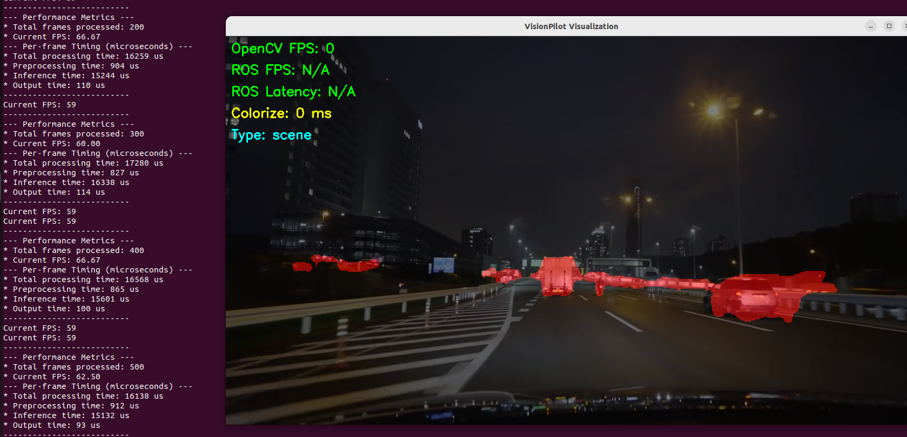

# Zenoh

## Dependencies

We need install zenoh and some dependencies first.

* **Zenoh C library**: Required for the transportation.
* **CLI11**: Used for the command line interface.
* **just**: Simplify the command.
* **parallel**: Run commands in parallel

```bash
# Setup the apt repositories
## Eclipse Zenoh
curl -L https://download.eclipse.org/zenoh/debian-repo/zenoh-public-key | sudo gpg --dearmor --yes --output /etc/apt/keyrings/zenoh-public-key.gpg
echo "deb [signed-by=/etc/apt/keyrings/zenoh-public-key.gpg] https://download.eclipse.org/zenoh/debian-repo/ /" | sudo tee /etc/apt/sources.list.d/zenoh.list > /dev/null
## just
wget -qO - 'https://proget.makedeb.org/debian-feeds/prebuilt-mpr.pub' | gpg --dearmor | sudo tee /usr/share/keyrings/prebuilt-mpr-archive-keyring.gpg 1> /dev/null
echo "deb [arch=all,$(dpkg --print-architecture) signed-by=/usr/share/keyrings/prebuilt-mpr-archive-keyring.gpg] https://proget.makedeb.org prebuilt-mpr $(lsb_release -cs)" | sudo tee /etc/apt/sources.list.d/prebuilt-mpr.list
## Install dependencies
sudo apt update
sudo apt install libzenohc-dev \
                 libcli11-dev \
                 just \
                 parallel
```

## Build

* Clean the project

```bash
just clean
```

* Build the code
    * Note that you need to export the path you install libraries first

```bash
export LIBTORCH_INSTALL_ROOT=/path/to/libtorch/
export ONNXRUNTIME_ROOTDIR=/path/to/onnxruntime-linux-x64-gpu-1.22.0
cd Zenoh
just all
```

## Usage

```bash
# Original video pub/sub
just run_video_pubsub
# SceneSeg
just run_sceneseg
# DomainSeg
just run_domainseg
# Scene3D
just run_scene3d
```

!!! warning
    It will take sometimes to transform ONNX into TensorRT format first time you run the model.


