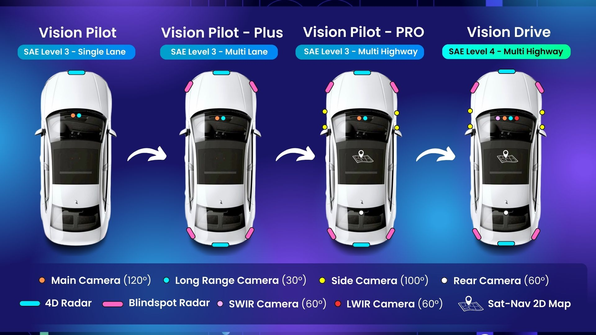

# System Configuration

The section describes the system configuration of the PoV vehicles. It shows the options to design your own PoV vehicles. The configuration consists of ECU selection, development approach, middleware candidates, etc.

The system for PoV is still under software development (2025.09). This document will be updated when more information is available. This guideline provides the software architecture and software deployment. 

The system is organized as the following. VisionPilot separates core AI processing from middleware-specific implementations, enabling seamless deployment across different robotic frameworks. It supports ROS2 and Zenoh as the middleware layer. In the common layer, there are inference enginers, visualization engines, and sensor input processing module. 

┌─────────────────────────────────────────────────────────┐
│                    MIDDLEWARE LAYER                     │
├─────────────────────┬───────────────────┬───────────────┤
│       ROS2          │      Zenoh        │    Future     │
│   Implementation    │  Implementation   │ Middlewares   │
│                     │                   │               │
│   ┌─────────────┐   │  ┌─────────────┐  │               │
│   │ ROS2 Nodes  │   │  │ Zenoh Nodes │  │      ...      │
│   │ & Topics    │   │  │ & Messages  │  │               │
│   └─────────────┘   │  └─────────────┘  │               │
└─────────────────────┴───────────────────┴───────────────┘
                       │                   
┌─────────────────────────────────────────────────────────┐
│                    COMMON LAYER                         │
│              (Framework Independent)                    │
├─────────────────────┬───────────────────┬───────────────┤
│  Inference Backends │ Visualization     │ Sensor Input  │
│                     │ Engines          │ Processing    │
│  • ONNX Runtime     │                   │               │
│  • TensorRT         │ • Segmentation    │ • Video       │
│  • Custom Backends  │ • Depth Maps     │ • Camera      │
│                     │ • Point Clouds    │ • Streaming   │
└─────────────────────┴───────────────────┴───────────────┘

## Version

There are four phases on the roadmap.

## Hardware Selection

The PoV software stack heavily relies on the inference models, which means high performant GPU is required.

Here is the rough GPU requirements:

- Vision Pilot: 50-80 TOPS
- Vision Pilot Plus: 150 TOPS
- Vision Pilot Pro: 500 TOPS
- Vision Drive: 1000 TOPS

NVIDIA GPU is well supported. AMD, Qualcomm and other vendors (e.g. NPU Halio-8) are on the roadmap.

## Development Approach

- **Native Installation**: Direct installation on hardware for maximum performance
- **Containerized Development**: Reproducible environments with easier team collaboration (on the roadmap)

## Middleware Choice

Now the PoV supports two kinds of pipeline:

- **ROS**: Able to bridge with the existing Autoware system.
- **Zenoh**: High performant middleware.
